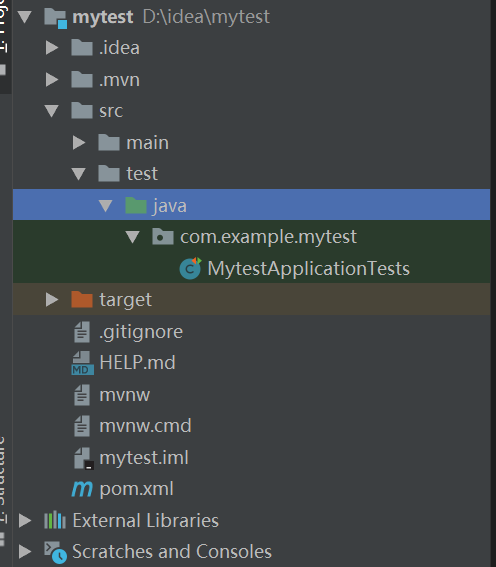

# Spring 入门

## 概述

### Spring是什么

Spring是一个开发应用框架，它通过四个关键策略来降低Java开发的复杂性

* 基于POJO(普通java对象)的轻量级和最小侵入性编程
* 通过依赖注入和面向接口实现松耦合
* 基于切面和惯例进行声明式编程
* 通过切面和模板减少样板式代码

## Spring结构图

<div align = center>
 
</div>
Spring框架采用分层架构，包含Data Access/Intergration,Web,Core Container,Test等模块

### Data Access/Intergration

数据访问/集成层，主要包含如下模块

* JDBC:提供一个JDBC的样板，消除冗长的JDBC代码
* ORM:提供与“对象-关系“映射框架的无缝集成
* OXM:提供一个Object/XML映射实现，可以使得java对象和XML数据之间相互映射
* JMS：java的消息服务，功能为生产/消费信息
* Transactions:Spring事务管理

### Core Container

核心容器，主要包含如下模块

* Beans:提供了BeanFactory(一个工厂模式的经典实现)
* Core:提供了Spring框架的基本组成部分，包含Ioc和DI
* Context(上下文模块):建立在Core和 Beans的基础之上，它是访问定义和配置任何对象的媒介。ApplicationContext 接口是上下文模块的焦点
* Expression Language:一种表达式语言，可以帮助我们查询，修改，访问相关资源

### Web

* Web：提供了基本的 Web 开发集成特性
* Servlet：包括 Spring MVC。
* Struts ：包含支持类内的 Spring 应用程序，集成了经典的 Struts Web 层。
* Portlet：提供了在 Portlet 环境中使用 MVC实现，类似 Web-Servlet 模块的功能

### 其他模块

* AOP：提供了面向切面编程实现，允许定义方法拦截器和切入点，将代码按照功能进行分离，以降低耦合性。

* Aspects：提供与 AspectJ 的集成，是一个功能强大且成熟的面向切面编程（AOP）框架。
* Instrumentation：提供了类工具的支持和类加载器的实现，可以在特定的应用服务器中使用。
* Test：支持 Spring 组件，使用 JUnit 或 TestNG 框架的测试。

## 核心概念

### Ioc容器

本处参考了 https://www.liaoxuefeng.com/wiki/1252599548343744/1282381977747489   
我们定义一个在线书店的一些组件,其中Database是总的数据库

* BookService:获取书籍
* UserService:获取用户
* CartServlet:处理用户购买
* HistoryServlet:购买历史

```Java
public class BookService {
    private Config config = new Config();
    private DataSource datasource = new DataSource(config); 
    public Book getBook(BookID bookid){

    }
}
public class UserService {
    private Config config = new Config();
    private DataSource datasource = new DataSource(config);
    public Book getUser(UserID userid){
}
public class CartServlet extends HttpServlet {
    private BookService bookService = new BookService();
    private UserService userService = new UserService();
    public void userBuy(){

    }
}
public class HistoryServlet extends HttpServlet {
    private BookService bookService = new BookService();
    private UserService userService = new UserService();
    public void getHistory(){

    }
}
```

Spring的核心是提供了一个Ioc容器用于管理所有的轻量级JavaBean组件，同时提供一些如生命周期管理，组件装配，AOP支持等服务。 

Ioc意为控制反转。

* 在传统的应用程序中，控制权在程序本身，程序的控制流程完全由开发者控制。  
* 而在Ioc模式下，控制权由应用程序转移到了Ioc容器，所有的组件统一由Ioc容器进行创建和管理，应用程序只需要使用容器创建配置好的组件即可。

以上面的书店为例，
在传统模式下我们实例化CartServlet和HistoryServlet需要实例化大量重复的组件。

<div align = center>
 
</div>

Ioc模式下 Bookservice代码如下，其他组件的代码进行类似的改变。这里BookService不会自己创建Database，而是等待外部注入。

```Java
public class BookService {
    private DataSource dataSource;

    public void setDataSource(DataSource dataSource) {
        this.dataSource = dataSource;
    }
} 

```


Ioc模式下，组件统一由Ioc创建管理，所以我们只需要将创建出的组件根据需要进行注入即可。

<div align = center>
 
</div>
可以看到箭头的流向相反，代表控制权的反转。

这种方法称为依赖注入，这种做法有一系列好处。为了更好的理解这种方式，我们会在下面进一步介绍。

### 依赖注入

本处使用《Spring 实战》中的例子

我们定义一个勇敢骑士如下

```Java
public class BraveKnight implements Knight {

    private DamselRescuringQuest quest;
    public BraveKnight(){
        this.quest = new DamselRescuringQuest();
    }
    public void embarkOnQuest() {
        quest.embark();
    }
}
```

这个勇敢骑士类实例化了一个拯救少女任务，并执行。
我们可以看到BraveKnight和DamselRescuringQuest高度耦合，骑士仅仅能够拯救少女而无法做其他的事情。

当我们使用依赖注入后，代码如下

```Java
public class BraveKnight implements Knight {

    private Quest quest;
    // 构造器注入
    public BraveKnight(Quest quest){
        this.quest = quest;
    }
    public void embarkOnQuest() {
        quest.embark();
    }
}
```

这时任何一个使用Quest接口的任务都可以被注入到BraveKnight中。这种使用接口来表示依赖关系的松耦合可以在对象毫不知情的情况下替换具体实现。  
并且，由于组件获取实现的方式是外部的注入，这种方法可以简化我们的测试步骤，如在我们的书店例子中，如果组件自己创建实例，那么测试只能使用真实的数据库，而使用依赖注入则可以使用自己构建的一些数据库。


### AOP

* 横切关注点:影响应用多处的功能(如下图中的日志和安全)
* 切面：横切关注点模块化得到的特殊的类，是通知和切点的结合
* 通知：切面的工作定义为通知
* 连接点：所有能应用通知的点
* 切点：切面所通知的连接点
* 引入：向现有类添加新的方法或属性
* 织入：将切面应用到目标对象并创建新的代理

我们引入AOP是基于这样的一个考虑：在一个被划分成模块的应用中，每个模块的核心功能都提供了某种特殊服务。除此之外，模块中还包含一些诸如安全和日志等基本的辅助功能。这些功能与核心业务无关，是与业务的应用逻辑相分离的。我们引入AOP就是为了将所有的关注点集中到一处，而不是分散在项目各处。

<center>
    
    <br>
    <div>关注点分离</div>
</center>


<center>
    
    <br>
    <div>关注点集中</div>
</center>

AOP实质上是对目标对象(bean)的一次封装，在外面加上了一个代理。所有调用者试图调用目标bean的方法时会被代理拦截，然后根据代码在调用方法之前/之后/环绕时执行切面逻辑(如安全检查，日志等)

<center>
    
    <br>
    <div>调用方法会被代理拦截</div>
</center>

## Spring boot

Spring Boot是一种简化spring 项目初始搭建和开发过程的框架，它有如下几个特点

* 可以创建独立运行的Spring应用程序，可以使用Maven创建可执行的jar
* 内嵌Tomcat等Servlet容器
* 提供自动配置的starter项目对象模型以简化Maven配置
* 自动配置Spring
* 提供一些准备好的特性，如应用监控，外部配置等
* Spring Boot不是借助代码，而是借助条件注解来实现的。

### Spring 启动

spring启动流程如下
<center>
    
    <br>
    <div>springboot启动</div>
</center>

1. 创建一个SpringApplication 的实例，运行实例的run方法
2. 向所有SpringSpplicationRunListener通告"Spring Boot应用要开始执行"
3. 床就按配置SpringBoot所需环境
4. 向所有SpringSpplicationRunListener通告"Spring Boot环境准备就绪"
5. 是否打印Banner
6. 根据具体情况创建应用上下文
7. 对应用上下文进一步进行处理
8. 向所有SpringSpplicationRunListener通告"Spring Boot应用上下文准备就绪"
9. 将各种配置加载到已经准备完毕的应用上下文中
10. 向所有SpringSpplicationRunListener通告"Spring Boot应用上下文装填完毕"
11. 调用ApplicationContext的refresh()方法，完成Ioc容器可用的最后一步
12. 遍历执行CommandLineRunner
13. 向所有SpringSpplicationRunListener通告"Spring Boot应用启动完成"

### 以实例说明Spring boot的结构

Spring boot大致分为四层
* DAO层：包含数据库访问的接口和实现，有时也用Mapper命名
* Bean层：数据库表的映射实体类，存放POJO对象
* Service层：实现业务接口和业务逻辑，有时也会分出两个文件夹分别表示接口和实现
* Controllor层：实现与web前端的交互

这种说法是帮助我们理解，实际操作中并不需要对每层创建文件夹

我们以一个简单的登录应用为例介绍

#### 项目结构

<center>
    
    <br>
    
</center>


#### 数据库数据

数据库内数据为：
<center>
    
    <br>
    <div>数据库数据</div>
</center>